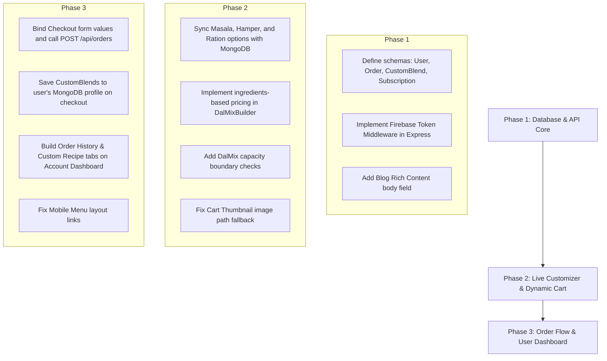

# Hadoti Farms E-Commerce Platform — Deep System & UX Audit

> [!NOTE]
> This audit was conducted across both the frontend React/TanStack Start workspace and the backend Express/MongoDB server to locate bugs, missing implementations, data integrity issues, and layout anomalies.

---

## Executive Summary

The **Hadoti Farms** platform possesses a visually beautiful, highly premium, and modern **organic editorial minimalist UI**. The typography (featuring *Cormorant Garamond* and *Space Mono*), curated natural palette (`#F5F0E8` background, `#8B5E3C` earth tone), custom-tailored smooth micro-interactions (leveraging *GSAP* and *ScrollTrigger*), and robust TypeScript/TanStack Router configuration set a world-class aesthetic standard.

However, beneath this premium surface, the core transactional infrastructure remains **incompletely implemented**, with a large disconnected gap between the **Frontend Web App** (powered by Firebase Web SDK & local store state) and the **Backend REST API** (powered by Express & MongoDB). 

Currently, several high-impact user flows (such as checkout, user profile fields, orders, custom blends, and subscriptions) run in a **simulated prototype mode** where critical business data is not verified, validated, or persisted to any database.

---

## Component & Feature Deep Dive

### 1. Authentication System (`/account` & `/checkout`)
*   **State:** Integrated with Firebase Auth Web SDK alongside a mock preview fallback.
*   **Key Findings:**
    *   **Backend Auth Gap:** The backend Express API (`/api/*`) has *no* authentication middleware, token verification, or session checking whatsoever. Every endpoint is completely public.
    *   **No User Database Sync:** When a user signs up on the frontend via Firebase, there is no corresponding `User` document created in the MongoDB database. 
    *   **Mobile Layout Gap:** The mobile menu overlay occupies the full screen but completely omits "Account" and "Cart" navigation options. Users on mobile devices cannot navigate to these critical transactional views easily.

### 2. Pantry & Products (`/shop` & `/product/$slug`)
*   **State:** Fully functional, loads dynamically from local MongoDB via Express server. Product details feature live dynamic nutrition index calculations when custom flour/atta blends are tweaked.
*   **Key Findings:**
    *   **Vite Directive Warnings:** During Vite client compilation, various `@tanstack/react-query` and `@tanstack/react-router` dependencies throw `"use client" module level directive ignored` warnings. While harmless, this pollutes logs and indicates minor bundler configuration misalignments.
    *   **Incomplete Reviews Tab:** The "Reviews" tab on the product detail page displays hardcoded, static text (`4.9 ★ across 248 reviews. "Tastes like home." — Aarti M.`) for every single product instead of loading actual database-driven product reviews.

### 3. Dal Mix Customizer (`/customize/dal-mix`)
*   **State:** Premium 3-step builder with slices rendering into an interactive SVG donut chart.
*   **Key Findings:**
    *   **Static Weight Pricing:** The pricing calculation does not correspond to the actual selected dals:
        ```typescript
        const basePrice = Math.round(target * 0.32);
        ```
        The price is calculated strictly as `weight * 0.32`, meaning a bag filled with inexpensive dals costs the exact same as one filled with premium monsoon dals, and a bag containing `0g` of ingredients still bills the base amount.
    *   **No Weight Limit Validation:** A user can choose a `500g` bag and put `2000g` of dals into it, or select a `2kg` bag and put only `25g` of dals into it. There is no boundary checking or warning that the selection exceeds or fails to meet the bag's capacity.
    *   **Zero-Weight Addition Bug:** A user can add a `0g` custom mix to their cart and successfully proceed through checkout.

### 4. Other Customizers (`/customize/masala`, `gift-hamper`, `ration-box`)
*   **State:** Operational frontend interactive views.
*   **Key Findings:**
    *   **Frontend Hardcoding:** Unlike the Dal mix customizer which correctly fetches options from the backend (`/api/dal-options`), all options, ingredients, sizes, and pricing modifiers for Masalas, Gift Hampers, and Ration Boxes are **entirely hardcoded** in the React source code. Admin updates would require a source redeployment.

### 5. Cart System (`/cart`)
*   **State:** Uses a client-side Zustand store.
*   **Key Findings:**
    *   **Missing Thumbnails:** In the Cart list view, every item renders a static brown gradient block instead of utilizing the product's actual image URL:
        ```typescript
        <div className="w-28 h-28 shrink-0" style={{ background: "linear-gradient(160deg,#8b5e3c,#2c1d12)" }} />
        ```
        This looks highly incomplete since `CartItem` already has an `image` string attribute.

### 6. Checkout Flow & Order Processing (`/checkout`)
*   **State:** 3-step shipping, payment, and confirmation screen.
*   **Key Findings:**
    *   **Transient Delivery Inputs:** The inputs for the Delivery Details form (Name, Phone, Address, City, State, PIN) are not bound to any state or store. When the form submits, all values are immediately thrown away.
    *   **No Order Placement API:** Clicking "Place Order" calls a local `place()` function which clears the cart and updates state to Step 2 (Thank You). It does **not** call any backend API, doesn't verify payment details, and never records the order.
    *   **No MongoDB Order Schema:** There is no `Order` database model or collections inside the MongoDB database.

### 7. Account Dashboard (`/account`)
*   **State:** Display dashboard block.
*   **Key Findings:**
    *   **Broken Dashboard Redirects:** The "Orders" button redirects to the Shopping Cart (`/cart`) rather than showing past orders. The "Saved Blends" button redirects to the generic Customizer Hub (`/customize`) rather than listing the user's specific custom recipes.
    *   **Hardcoded Subscriptions:** The "Active Subscriptions" section displays a static paragraph with a preset delivery date ("June 5, 2026") regardless of who is logged in or if they have ever selected a subscription.

### 8. Journal & Blog (`/blog` & `/blog/$slug`)
*   **State:** Blog index correctly displays posts from MongoDB.
*   **Key Findings:**
    *   **Hardcoded Placeholder Post Body:** The blog post detail page (`/blog/$slug`) renders static placeholder content for the body text on every article rather than fetching actual rich text fields from the database:
        ```html
        <p>This is a placeholder body for the journal entry. Real long-form writing... lives here in production.</p>
        ```

---

## Comprehensive Bug & Issue Registry

| ID | Location | Feature | Severity | Bug / Gap Description | Recommended Action |
| :--- | :--- | :--- | :--- | :--- | :--- |
| **B01** | `src/routes/cart.tsx#L37` | Cart | **Medium** | Renders static CSS gradients rather than actual product image thumbnails. | Update the markup to render `i.image || imageFor(i.slug)`. |
| **B02** | `src/routes/checkout.tsx#L333` | Checkout | **High** | Delivery details form inputs are completely unbound; values are immediately lost on step progression. | Create a state hooks object or a form controller and store the shipping data. |
| **B03** | `src/routes/checkout.tsx#L34` | Checkout | **Critical** | Placing an order does not contact the backend or save the transaction; it simply clears the cart. | Implement `/api/orders` endpoints and call them inside the `place()` submit handler. |
| **B04** | `customize.dal-mix.tsx#L63` | Customizer | **Medium** | Dal mix price is static-weight based. Filling the box with 0g of dals still costs the base price. | Calculate price dynamically as the sum of selected dal weights multiplied by individual ingredient cost rates. |
| **B05** | `customize.dal-mix.tsx` | Customizer | **Medium** | No boundary validation. Users can overfill a 500g pouch to 2000g or add a 0g empty pouch. | Add validation checking if `total` is within $\pm 10\%$ of `target`, and disable progression if it is empty. |
| **B06** | `src/routes/account.tsx#L118` | Dashboard | **High** | Dashboard buttons redirect to Cart (`/cart`) and Customizers (`/customize`) instead of displaying real customer records. | Implement `OrderHistory` and `SavedBlends` tabs directly inside the Dashboard. |
| **B07** | `src/routes/account.tsx#L130` | Dashboard | **Medium** | Subscription summary is a static hardcoded paragraph. | Query user subscription records from the backend and hide this block if no subscription exists. |
| **B08** | `src/routes/blog.$slug.tsx#L37` | Blog | **Medium** | Detail page features static boilerplate paragraph instead of rendering an actual article body from the database. | Add a `content` field to the `BlogPost` MongoDB schema, seed it, and render it in `PostPage`. |
| **B09** | `src/components/layout/Navbar.tsx#L136`| Mobile Menu | **Low** | The mobile overlay is missing links to "Cart" and "Account" dashboards, preventing user navigation. | Add "Cart" and "Account" items below the primary navigation links in the mobile menu overlay. |
| **B10** | `backend/routes/api.js` | Security | **Critical** | The backend routes do not enforce user authentication or check authorization headers. | Add Firebase ID Token verification middleware to protect user-specific backend routes. |

---

## Strategic Action & Implementation Plan

To evolve Hadoti Farms from a stunning frontend prototype into a robust, high-volume production platform, we recommend a 3-phase technical implementation:



### Phase 1: Database Schemas & Authentication Security
1.  **MongoDB Schema Expansion:**
    *   Create `User.js` model storing `uid`, `email`, `displayName`, and active address book arrays.
    *   Create `Order.js` model holding order number, `user` ref, `items` array (with full customizer specs), `shippingAddress`, `subtotal`, `deliveryFee`, `total`, and `status`.
    *   Create `CustomBlend.js` model storing `user` ref, `name`, `blendType` (dal, masala, flour), and exact ingredient breakdown.
2.  **Express Auth Middleware:**
    *   Integrate `firebase-admin` into the backend.
    *   Add verification middleware that checks for `Authorization: Bearer <ID_TOKEN>`, authenticates the request, and assigns the verified `req.user`.

### Phase 2: Live Customizers & Cart Image Alignment
1.  **Migrate All Option Catalogues to MongoDB:**
    *   Seed Masalas, Hampers, and Grains options into the database and retrieve them dynamically via front-end loaders, removing all hardcoded catalogues.
2.  **Upgrade Customizer Pricing & Ratios:**
    *   Assign individual cost-per-gram prices to every dal option. Calculate customizer pricing dynamically on update.
    *   Introduce validation rules inside customizer viewports that prevent checkout addition until ingredients match the chosen package size capacity.
3.  **Fix Cart Thumbnails:**
    *   Update `src/routes/cart.tsx` to render the correct image attribute if available, falling back gracefully to standard imagery.

### Phase 3: Transaction Completeness & Dashboards
1.  **Productionize Checkout:**
    *   Bind checkout inputs to a local state store.
    *   When the user submits payment, send a POST request containing order items, custom blends, shipping addresses, and user ID to `/api/orders`.
2.  **Implement Actual User Dashboard:**
    *   Replace hardcoded order lists, saved blends, and subscriptions on the Account dashboard with actual backend query data.
    *   Provide direct edit/reorder hooks next to previously saved recipes.
